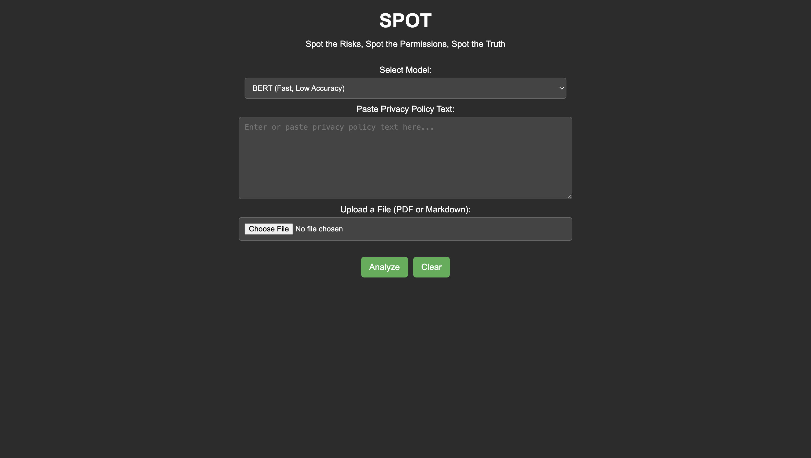
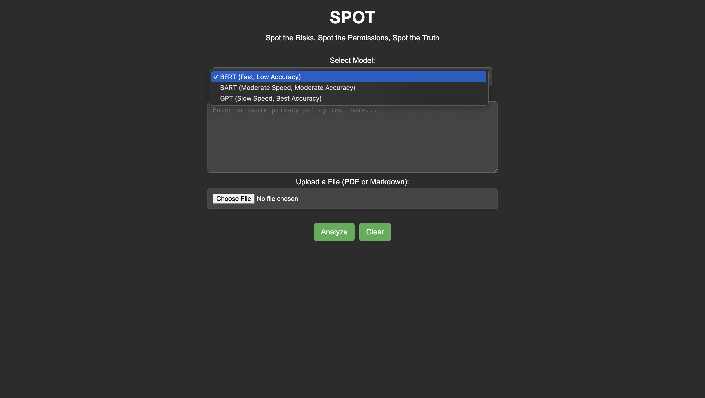
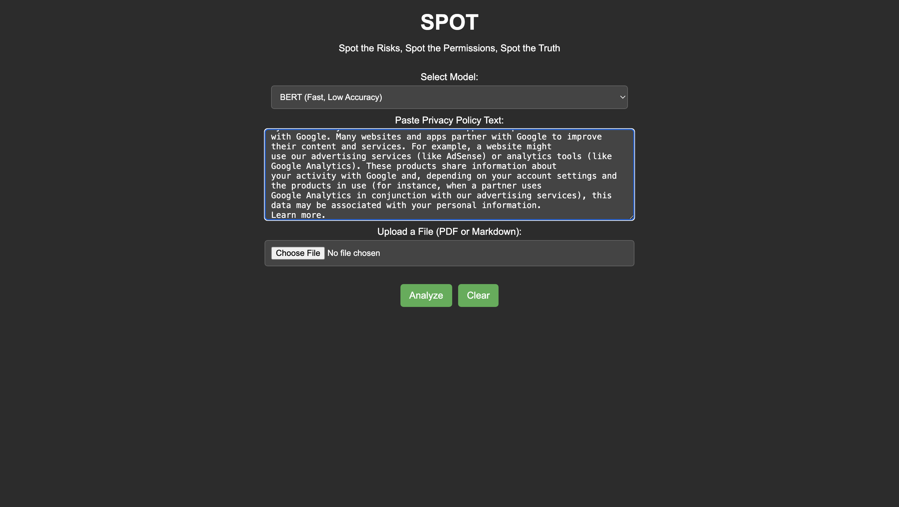
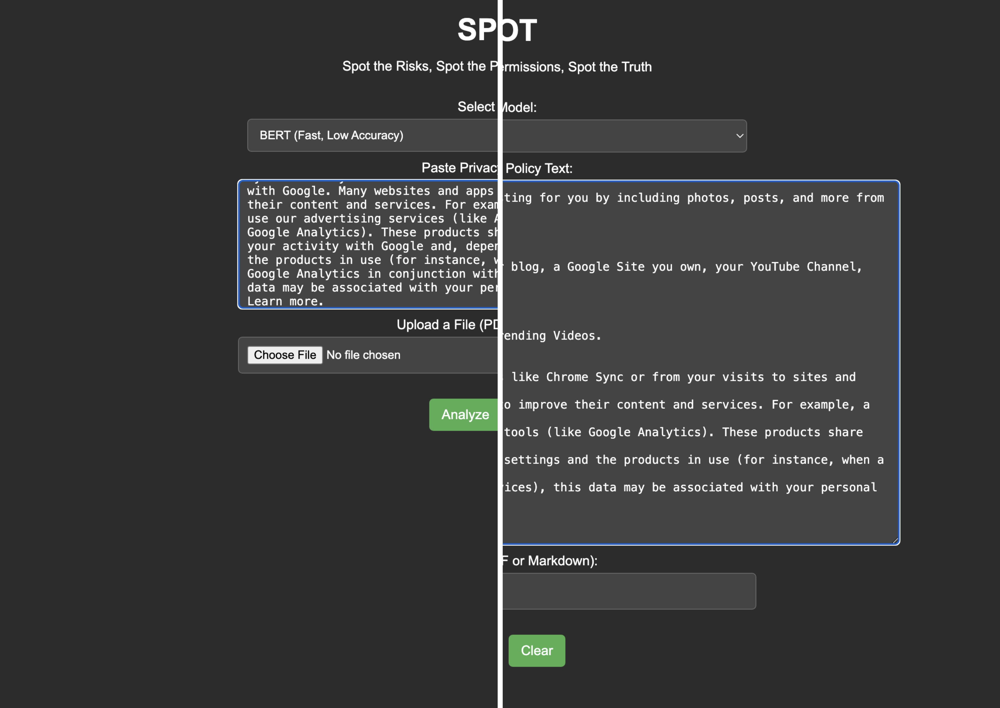
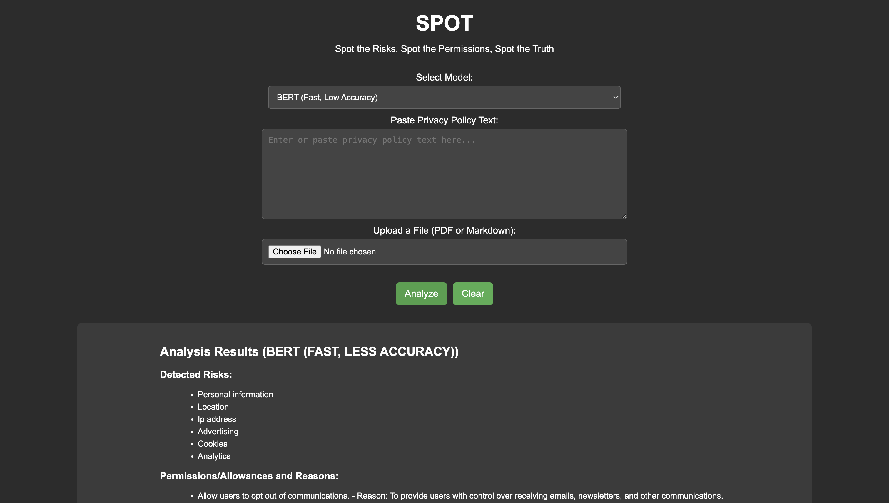

# Spot - AI-Powered Privacy Policy Analyzer

Spot is an intelligent application designed to analyze privacy policies efficiently. The app leverages advanced AI models to extract essential insights, including detected risks, permissions/allowances, and a concise summary of the privacy policy. It also runs in the background to monitor suspicious activities, notifying users of potential risks and providing actionable options.

## Features

- **AI Model Selection**: Choose between three powerful AI models for analysis:
  - **BERT**: Fast processing with low accuracy.
  - **BART**: Moderate speed with moderate accuracy.
  - **GPT**: Slow processing but offers the best accuracy.

- **Resizable Input Container**: Adjust the size of the input container for better readability when pasting or viewing lengthy privacy policies.

- **Clear Functionality**: Clear the pasted privacy policy, selected file, or the output/results with a single click.

- **Scrollable Output**: The results include detected risks, permissions/allowances, and a summary. Scroll down to view the complete analysis.

- **Background Monitoring**: Spot runs in the background, monitoring suspicious activities. For example, if a website accesses your location without proper explanation, Spot will notify you of the potential risk and give you the option to disable the permission (e.g., location sharing).

- **Automated Permission Management**: In the future, Spot will allow users to automatically disable permissions based on past behavior. If you frequently disable location sharing, Spot can automatically do so when it detects suspicious activities involving location access.

- **Pattern Learning**: The app will learn from the user's past actions and adjust its notifications and automatic permissions management accordingly.

- **Downloadable Results**: Users will have the option to download their analysis results, either to store them locally or share them online.

- **Community Sharing**: Future versions will include a community feature where users can share their experiences, discuss results, and compare findings. This will help create a strong, trusted community around the app.

---

## Screenshots

### Default Screen

- The app starts with the default model set to **BERT**. Users can switch models from the dropdown menu.

### AI Model Selection

- Choose one of the three available models for analysis:
  - **BERT**: Fast processing with low accuracy.
  - **BART**: Moderate speed with moderate accuracy.
  - **GPT**: Slow processing but offers the best accuracy.

### Paste Privacy Policy

- Paste your privacy policy into the input container. You can also load a privacy policy file directly into the app.

### Resizable Input Container

- The input container can be resized to accommodate longer privacy policies for better readability.

### Analysis Output

- The output is categorized into three sections:
  1. **Detected Risks**
  2. **Permissions/Allowances**
  3. **Summary**

- **Note**: Scroll down to see the complete results if the content exceeds the visible area.

---

## How It Works

1. **Start the App**: The app launches with the default AI model (BERT).
2. **Paste or Upload**: Input a privacy policy by pasting it into the container or uploading a file.
3. **Select Model**: Choose your preferred model for analysis based on speed and accuracy.
4. **Analyze**: Run the analysis to extract detected risks, permissions, and a summary of the policy.
5. **Resize Input**: Adjust the size of the input container for longer policies.
6. **Clear**: Use the "Clear" button to reset the input or output fields.

---

## Future Enhancements

- **Support for Additional AI Models**: In the future, Spot will expand its capabilities by supporting additional AI models, allowing users to choose from a wider range of options. This will provide more flexibility, enabling users to select a model that suits their specific needs in terms of speed and accuracy. Whether you're looking for faster processing or more precise results, additional models will cater to a variety of use cases.

- **Background Monitoring and Suspicious Activity Notifications**: One of the key future features of Spot is background monitoring, which will allow the app to continuously observe your device and notify you when suspicious activities are detected. For instance, if a website you visit accesses sensitive information like your location without a clear explanation, Spot will alert you to the potential risk. This feature will help ensure your privacy is protected in real-time by notifying you whenever potentially harmful actions are happening in the background, similar to how VPNs run continuously to secure your connection.

- **Automated Permission Management Based on User Behavior**: Spot will introduce a feature that allows it to learn from your past behavior and automatically manage your privacy settings based on your preferences. For example, if you frequently disable location sharing on websites or apps, Spot will eventually learn this pattern and automatically disable location access when similar suspicious activities are detected in the future. This will save users time and effort by making privacy management proactive rather than reactive, ensuring that their permissions are consistently aligned with their past preferences.

- **Downloadable and Shareable Analysis Results**: Users will have the ability to download their privacy policy analysis results for offline use or sharing. This feature will allow individuals or organizations to store the results on their devices, share them with colleagues or stakeholders, or keep a record of their analysis for future reference. In addition to storing results locally, Spot will also offer the option to share these results online, enabling users to easily exchange information and insights with others.

- **Community Feature for Sharing, Discussion, and Comparison**: Spot will include a community feature that allows users to interact with others, share their experiences, and compare privacy policy results. Users will be able to discuss their findings, ask questions, and share tips for improving privacy management. This feature will foster collaboration and build a trusted community around the app, helping users feel more confident in the app's capabilities. By building a strong online community, Spot will also be able to gather valuable feedback to improve its features and provide more accurate privacy protection to its users.

---

## Contributors

Developed by **Andrew Sebastian Sibue** and **Nicholaus Santo Agnus Dei**.  
Feel free to report issues or suggest enhancements!

---

## License

This project is licensed under the MIT License - see the [LICENSE](./LICENSE) file for details.

